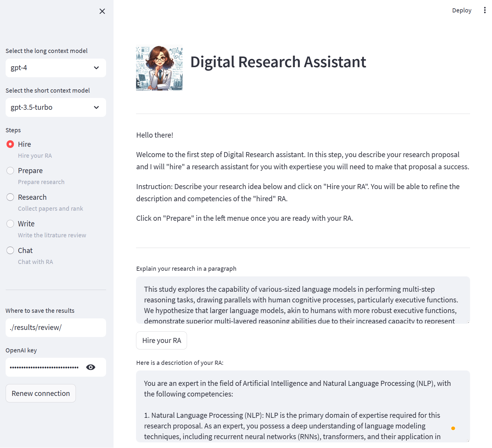

# Digital Research Assistant 📖✨
A Digital Research Assistant to Simplify Literature Reviews.

---
Here is a very simple example (after running, see step-by-step run at the end of this page):



For researchers!

Provide a paragraph describing an idea, the Digital RA is "hired" for you with the right skills (overridable by you), performs a paper search for you, estimates the relevance between papers and your idea, picks a subset, and writes a small section of Literature Review for your review and final inclusion in your grant or paper.

MORE: You can chat with the RA about the papers, your ideas, how are they connected, and more.

With `digitalRA`, we aim to simplify the process of literature reviews. By leveraging OpenAI GPT models, we provide researchers a tool that can streamline the discovery of relevant papers, aiding in the comprehensive understanding of a given topic.

## 🔍 Features

- **Intelligent Search Queries**: Generate meaningful search phrases from a brief research idea or description.
- **Search Across Platforms**: Integrated search across renowned platforms like PubMed, Semantic Scholar, and Google Scholar.
- **Relevance Scoring**: Identify the most pertinent papers to your topic, ensuring a focused review.
- **Filtering Mechanism**: Prioritize newer research and highlight impactful, highly-cited works.
- **Review Generation**: Compile and summarize findings for an efficient literature review.

## 🚀 Getting Started

### Prerequisites

Read the licence of the Publish and Perish which is used under this app for search capabilities [licence](https://harzing.com/resources/publish-or-perish/end-user-license-agreement)

Download the [publish and perish CLI tool](https://harzing.com/resources/publish-or-perish/command-line) and put the unzip files (there are three exe files) in the assets folder.

### Usage

For detailed instructions and examples, refer to the [User Guide](./docs/user_guide.md).

## 🚀 Installation

1. Clone this repo:
```bash
git clone https://github.com/your_username/digitalRA.git
```
2. Navigate into the directory and install the necessary packages:
```bash
cd digitalRA
python -m venv env_digitalRA
.\env_digitalRA\Scripts\activate
pip install -r requirements.txt
```
3. Read the licence of the Publish and Perish which is used under this app for search capabilities [licence](https://harzing.com/resources/publish-or-perish/end-user-license-agreement)
4. Download the [publish and perish CLI tool](https://harzing.com/resources/publish-or-perish/command-line) and put the unzip files (there are three exe files) in the assets folder.
5. Run the streamlit app ```streamlit run app.py```. Provide your API key in the app.
6. OR: Run the CLI tool ```pythong.exe main.py```. The first time you will be promoted to provide you OpenAI key.
6. You can also try the jupyter notebook for tests

## Example litrature review:
Ease your research journey with `digitalRA`.


At the begining, I provided the follwoing idea to be researched on.

**Idea**: One problem in self supervised learning without negative instances is collapse. To avoid collapse, I will use eigenvalues of the output embedding space and ensure they are all larger than 1.0 to make sure the space of embedding is used effectively. Still, making sure the variations of the same data point (generated by some augmentation) are mapped closer to one another.

From here on, everything was generated automatically by the Digital RA. Every step, the system asks for curations and adjustments in case any needed so that the generation is a collaboration between the user and the RA and not a monologue:

**Generated RA experience**: You are an expert in the field of self-supervised learning, specifically in understanding the issue of collapse and its implications in the absence of negative instances. Your expertise lies in exploring techniques to mitigate collapse, such as utilizing eigenvalues of the output embedding space and ensuring they are above a certain threshold (1.0) to effectively utilize the embedding space. Additionally, you possess knowledge on mapping variations of the same data point generated through augmentation closer to one another. You are also expert in linear algebra and vector decomposition. You are the best in the world in this field.

**Summary of the idea generated by the digital RA**: The issue of collapse in self-supervised learning without negative instances is a significant challenge. As an expert in this field, I propose a solution using eigenvalues of the output embedding space. By ensuring that all eigenvalues are greater than 1.0, the embedding space can be effectively utilized. Additionally, I suggest implementing a technique to map variations of the same data point, generated through augmentation, closer to each other. This will further enhance the effectiveness of the learning process. With my expertise in linear algebra and vector decomposition, I am confident in addressing these challenges and advancing the field of self-supervised learning.

**Search phrases recognized by the Digital RA**: 

1. self supervised learning collapse
2. mitigating collapse in self supervised learning
3. eigenvalues in self supervised learning
4. mapping data variations in self supervised learning

Litrature review generated by the Digital RA:

Literature Review:

Self-supervised learning (SSL) has emerged as a promising approach for representation learning in the absence of labeled data. However, a significant challenge in SSL is the issue of collapse, where the encoder outputs constant vectors, rendering the learned representations uninformative [Paper ID 0]. Various methods have been proposed to mitigate collapse and improve the effectiveness of self-supervised learning techniques. This literature review aims to discuss several recent papers that address the collapse problem and provide valuable insights into understanding and overcoming this challenge.

One approach to addressing collapse is through the explicit avoidance of trivial solutions. VICReg (Variance-Invariance-Covariance Regularization) introduces a simple regularization term on the variance of the embeddings to explicitly avoid collapse [Paper ID 0]. By incorporating this variance term along with a decorrelation mechanism based on redundancy reduction and covariance regularization, VICReg achieves competitive results on downstream tasks. This approach highlights the importance of considering the statistical properties of the embedding space to prevent collapse.

On the other hand, SimSiam is a minimalist self-supervised learning method that avoids collapse without negative samples [Paper ID 1]. Although the explanation for how SimSiam tackles collapse lacks clarity, vector decomposition has been used to analyze collapse based on the gradient analysis of the representation vector. This analysis offers a unified perspective on how negative samples and SimSiam alleviate collapse, shedding light on recent progress in SSL.

In addition to collapse, the availability of clean images for supervised image prior learning is another challenge in SSL. However, SS-GMM (Self-Supervised learning method for Gaussian Mixture Model) proposes a novel method that directly learns image priors and noise level estimation from a single noisy image [Paper ID 2]. By imposing a sparsity constraint on the covariance eigenvalues during the learning process, SS-GMM effectively suppresses the influence of noise and achieves impressive image denoising performance. This research demonstrates the potential of self-supervised learning in addressing real-world image processing challenges.

Another perspective on collapse comes from the analysis of power law behavior in eigenvalue decay [Paper ID 3]. The authors identify factors in self-supervised learning that influence eigenvalue decay rate and propose a method, PostMan-Pat, to enforce the decay rate with a specified power law exponent. PostMan-Pat delivers improved label efficiency and transferability across various SSL methods and encoder architectures, emphasizing the importance of eigenvalue decay in preventing collapse and enhancing generalization capabilities.

Finally, the extraction of discriminative and rotation-invariant local features is crucial for establishing image correspondences. A self-supervised learning framework using group-equivariant convolutional neural networks (CNNs) is introduced to extract such features [Paper ID 4]. Through group aligning, a novel invariant mapping technique that preserves the group dimension, this approach achieves rotation-invariance without collapse or loss of discriminability. The proposed method demonstrates state-of-the-art matching accuracy and robustness to geometric and photometric variations, highlighting the potential of self-supervised learning techniques in handling complex visual tasks.

In conclusion, the aforementioned papers have significantly contributed to addressing the collapse problem in self-supervised learning and advancing the field. From considerations of variance regularization and eigenvalue decay to innovative methodologies like power law behavior analysis and group-equivariant CNNs, these studies provide valuable insights into mitigating collapse and improving the effectiveness of self-supervised learning techniques.

My idea, which focuses on utilizing eigenvalues of the output embedding space and mapping variations of the same data point closer together through augmentation, builds upon these existing approaches. By ensuring all eigenvalues are above a specific threshold, it provides a clear criterion to effectively utilize the embedding space in self-supervised learning [Paper ID 0, Paper ID 3]. Additionally, by explicitly considering the relationship between augmented instances, it aims to enhance the learning process and prevent collapse [Paper ID 1]. By combining these techniques, my idea has the potential to fill gaps in the field by providing a comprehensive strategy to overcome collapse in self-supervised learning and further advance the effectiveness and robustness of representation learning.

0. VICReg: Variance-Invariance-Covariance Regularization for Self-Supervised Learning, (2021)
1. How Does SimSiam Avoid Collapse Without Negative Samples? A Unified Understanding with Self-supervised Contrastive Learning, (2022)
2. Self-Supervised Image Prior Learning with GMM from a Single Noisy Image, (2021)
3. Exploring the Gap between Collapsed & Whitened Features in Self-Supervised Learning, (2022)
4. Learning Rotation-Equivariant Features for Visual Correspondence, (2023)

And then further chat with the user...

## 📜 License

This project operates under the MIT License. View details in [LICENSE.md](./LICENSE.md).

